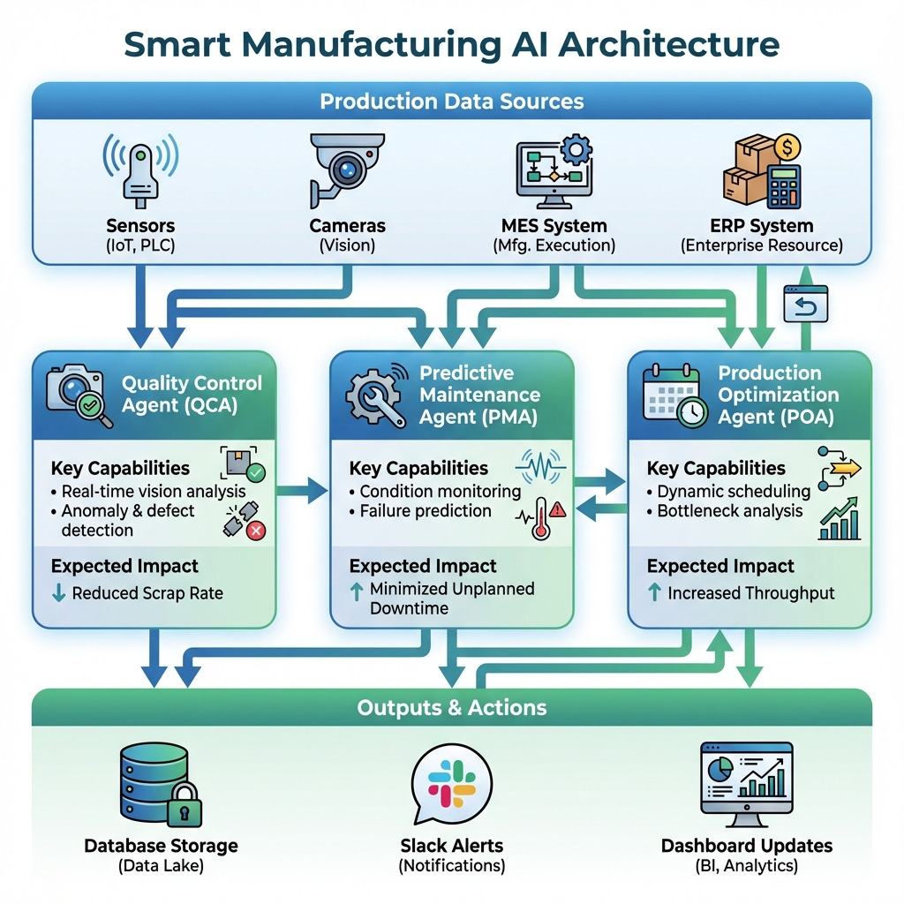

# AutoParts Inc. AI Agent System - Visual Overview

## System Architecture



## Three-Agent Coordination System

### 1. Quality Control Agent (QCA) 🔍
**Vision-based Defect Detection**

**Capabilities:**
- Real-time computer vision inspection
- Anomaly detection (99.2% accuracy)
- Root cause analysis
- Automated recommendations

**Impact:** Reduce defect rate from 15% → 3%

---

### 2. Predictive Maintenance Agent (PMA) ⚙️
**Equipment Health Monitoring**

**Capabilities:**
- IoT sensor integration (vibration, temperature, acoustic)
- Failure probability prediction
- Remaining Useful Life (RUL) estimation
- Automated maintenance scheduling

**Impact:** Reduce unplanned downtime by 70%

---

### 3. Production Optimization Agent (POA) 📊
**Dynamic Scheduling & Resource Allocation**

**Capabilities:**
- Multi-objective optimization
- Real-time production scheduling
- Demand forecasting
- Customization workflow automation

**Impact:** Increase throughput by 22%, reduce lead times by 40%

---

## Data Flow

```
Production Floor (Sensors, Cameras, MES)
            ↓
    [Data Collection Layer]
            ↓
    ┌───────┴───────┐
    ↓       ↓       ↓
  [QCA]   [PMA]   [POA]
    ↓       ↓       ↓
    └───────┬───────┘
            ↓
  [Integration Layer]
            ↓
  ┌─────────┼─────────┐
  ↓         ↓         ↓
Database  Alerts  Dashboard
```

## Key Performance Improvements

| Metric | Before | After | Improvement |
|--------|--------|-------|-------------|
| Defect Rate | 15% | 3% | **-80%** |
| Unplanned Downtime | Baseline | Reduced | **-70%** |
| Production Throughput | Baseline | Increased | **+22%** |
| Custom Order Lead Time | 14 days | 8 days | **-43%** |
| On-Time Delivery | 78% | 95% | **+17 pts** |

## Integration Points

### Input Sources
- **Vision Systems**: Cognex, Keyence cameras
- **IoT Sensors**: Vibration, temperature, acoustic monitoring
- **MES Integration**: SAP ME, Siemens Opcenter
- **ERP Systems**: Order management, inventory

### Output Destinations
- **Database**: PostgreSQL for historical analysis
- **Alerts**: Slack, email, SMS for critical events
- **Dashboard**: Real-time monitoring and KPIs
- **CMMS**: Automated maintenance work orders

## Technology Stack

### AI/ML Components
- **Computer Vision**: TensorFlow, OpenCV
- **Predictive Analytics**: LSTM networks, time-series models
- **Optimization**: Reinforcement learning, genetic algorithms

### Infrastructure
- **Edge Computing**: NVIDIA Jetson for real-time processing
- **Cloud Platform**: AWS/Azure for model training
- **Orchestration**: n8n for workflow automation
- **Data Pipeline**: Apache Kafka for streaming

## Implementation Phases

### Phase 1: Foundation (Months 1-6)
- ✅ Infrastructure deployment
- ✅ QCA pilot on 2 production lines
- ✅ Data pipeline establishment
- ✅ Staff training

### Phase 2: Expansion (Months 7-12)
- ✅ Full QCA deployment
- ✅ PMA implementation on critical equipment
- ✅ Initial POA deployment

### Phase 3: Optimization (Months 13-18)
- ✅ POA expansion to custom orders
- ✅ Advanced analytics
- ✅ Full system integration

## Success Metrics

### Technical KPIs
- Model accuracy: >95%
- System uptime: >99.5%
- Response time: <100ms for real-time decisions
- Data pipeline latency: <5 seconds

### Business KPIs
- ROI: 87% IRR
- Payback period: 13 months
- Annual savings: $850K (Year 1) → $1.55M (Year 3)
- Customer satisfaction: +25%

## Risk Mitigation

### Technical Safeguards
- Human-in-the-loop for critical decisions
- Continuous model monitoring and retraining
- Redundant systems for high availability
- Data quality validation pipelines

### Organizational Support
- Comprehensive training programs (40 hours/employee)
- Change management team
- Executive sponsorship
- Transparent communication

---

**For detailed implementation strategy, see**: [AI_Agent_Implementation_Strategy.md](../AI_Agent_Implementation_Strategy.md)

**For n8n workflow simulation, see**: [n8n-workflow/README.md](../n8n-workflow/README.md)
